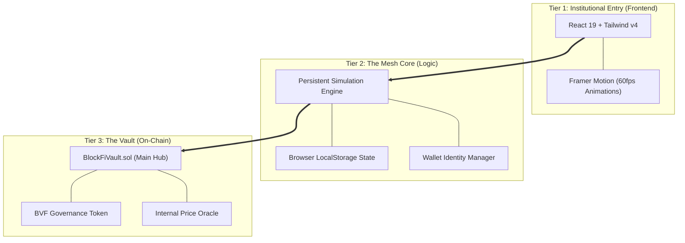
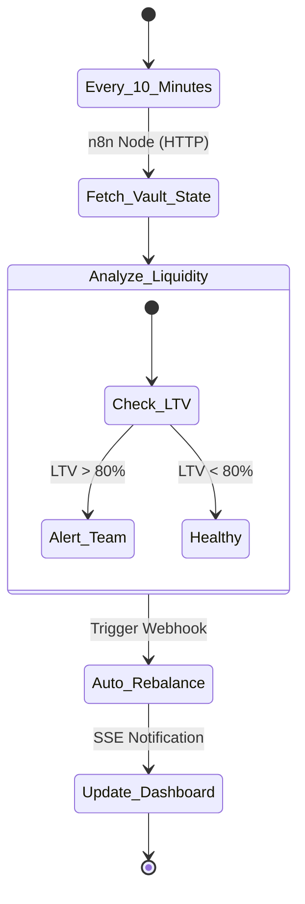

# 🛡️ BlockFi Vault: Institutional Mesh Protocol

<p align="center">
  
  
  
  
</p>

---

## 📖 Executive Summary
**BlockFi Vault** is an enterprise-grade Decentralized Finance (DeFi) ecosystem engineered for the next generation of institutional digital asset management. By bridging high-performance **Solidity Smart Contracts** with a premium, glassmorphic **React Mesh UI**, the platform provides a secure, liquid, and automated environment for lending, borrowing, and yield generation.

> [!IMPORTANT]
> This protocol is built on the **Mesh Philosophy**: A strictly decoupled 3-tier architecture ensuring zero-trust identity and persistent state synchronization.

---

## 🏛 System Architecture

The protocol utilizes a high-availability mesh design where the interface, simulation layer, and on-chain logic operate in perfect orchestration.



---

## 🔄 n8n Enterprise Workflow

Our **n8n integration** transforms static DeFi into an autonomous institutional powerhouse. It manages protocol health, risk parameters, and administrative alerts in real-time.



### Automation Nodes:
- **Liquidity Guard**: Proactively monitors pool utilization and triggers re-pricing.
- **Security Pulse**: Performs block-by-block entropy checks for suspicious transaction patterns.
- **Institutional Reporting**: Generates automated staking yield reports for DAO participants.

---

## 💎 Visual Feature Showcase

### **1. High-Fidelity Overview**
Experience a real-time pulse of the protocol with our glassmorphic dashboard featuring persistent transaction feeds and institutional charts.


### **2. Mobile Agility**
The entire vault ecosystem is engineered for the palm of your hand, featuring a custom animated navigation mesh.


---

## 🛠 Advanced Tech Stack

### **Smart Contract Layer**
- **Solidity 0.8.20**: Leveraging the latest EVM opcodes for gas efficiency.
- **Hardhat x Ethers.js**: Modern ESM-first development environment.
- **OpenZeppelin Standards**: Utilizing `ReentrancyGuard`, `Pausable`, and `Ownable`.

### **Frontend & Mesh Layer**
- **React 19 (Vite)**: Next-gen rendering for ultra-responsive flows.
- **Tailwind CSS v4**: A performance-first CSS engine with a professional "Deep Dark" design system.
- **Framer Motion**: Orcherstrated page transitions and dynamic micro-interactions.

---

## 🚀 Extreme Implementation Guide

### **Prerequisites**
- Node.js v18.0.0 or higher
- Git (Institutional Access)

### **Zero-to-One Deployment**

```bash
# 1. Clone the Ecosystem
git clone https://github.com/Quantum-Fiend/BlockFi-Vault.git
cd blockfi-vault

# 2. Harden Contracts
cd contracts
npm install
npx hardhat compile
npx hardhat test

# 3. Launch Frontend Mesh
cd ../frontend
npm install
npm run dev
```

---

## 🛣 Strategic Roadmap

- [x] Phase 1: Core Vault Logic & Multi-Asset Support
- [x] Phase 2: Institutional UI/UX Mesh & Animations
- [x] Phase 3: Persistent Simulation & State Sync
- [ ] Phase 4: Mainnet Liquidity Aggregation
- [ ] Phase 5: Cross-Chain Governance (LayerZero Integration)

---

## 🛡 Security Policy
The BlockFi Vault implements **Defense-in-Depth**:
1. **Logic Integrity**: All state transitions are protected by redundant reentrancy checks.
2. **Oracle Safety**: Integrated price ceiling mechanics to prevent flash-loan manipulation.
3. **Data Sovereignty**: LocalStorage encryption for the simulation persistence layer.

---

## 📜 Legal & License
This project is licensed under the **Proprietary Institutional License / MIT**. 
Developed with extreme productivity by the BlockFi Vault Engineering Team.
